# Marketing Agent Team - Complete Architecture Guide

## System Overview Diagrams

### 1. Overall Module Structure

```mermaid
graph TB
    subgraph "Marketing Agent Team Module"
        DIR[marketing-agent-team/]

        subgraph "Agents"
            BA[Brand Archetype Agent<br/>🎭]
            CA[Content Creation Agent<br/>✍️]
            MR[Market Research Agent<br/>🔍]
            CC[Competitor Analysis Agent<br/>🎯]
            AA[Analytics Agent<br/>📊]
            BS[Business Strategy Agent<br/>💼]
            CO[Campaign Orchestrator<br/>🎯]
        end

        subgraph "Workflows"
            BS_WF[Brand Setup Workflow]
            CC_WF[Content Creation Workflow]
            LR_WF[Learning & Refinement Workflow]
            MR_WF[Market Research Workflow]
            CI_WF[Competitor Intelligence Workflow]
            AR_WF[Analytics & Reporting Workflow]
            BS2_WF[Business Strategy Workflow]
            PC_WF[Parallel Campaign Factory]
            RO_WF[Real-Time Optimization Workflow]
        end

        subgraph "Data Storage"
            BM[Brand Profiles<br/>brand-archetype-sidecar/]
            LD[Learning Data<br/>learning-data/]
            AS[Analytics Sidecar<br/>analytics-sidecar/]
        end

        DIR --> BA
        DIR --> CA
        DIR --> MR
        DIR --> CC
        DIR --> AA
        DIR --> BS
        DIR --> CO

        BA --> BS_WF
        CA --> CC_WF
        CA --> LR_WF
        MR --> MR_WF
        CC --> CI_WF
        AA --> AR_WF
        BS --> BS2_WF
        CO --> PC_WF
        CO --> RO_WF

        BS_WF --> BM
        CC_WF --> BM
        CC_WF --> BM
        LR_WF --> LD
        AR_WF --> AS

        BM -.-> CA
        LD -.-> CA
        AS -.-> AA
    end

    style BA fill:#e1f5ff
    style CA fill:#fff4e6
    style MR fill:#f3e5f5
    style CC fill:#e8f5e9
    style AA fill:#fce4ec
    style BS fill:#fff3e0
    style CO fill:#e0f2f1
```



### 2. User Interaction Flow (How to Use the Module)

```mermaid
sequenceDiagram
    participant User as 👤 User
    participant CLI as 💻 Claude/BMAD
    participant Agent as 🤖 Agent
    participant Workflow as 📋 Workflow
    participant Data as 💾 Data Storage

    User->>CLI: agent brand-archetype-agent
    CLI->>Agent: Load agent YAML
    Agent->>Agent: Load sidecar memory
    Agent->>User: Show menu options

    User->>Agent: DB (Discover Brand Archetype)
    Agent->>Agent: Run embedded prompt
    Agent->>User: Ask brand questions
    User->>Agent: Provide answers
    Agent->>Data: Save brand profile

    Note over User,Data: Brand profile created ✅

    User->>CLI: agent content-creation-agent
    CLI->>Agent: Load agent YAML
    Agent->>Data: Read brand profile

    User->>Agent: GC (Generate Content)
    Agent->>Agent: Run embedded prompt
    Agent->>Agent: Apply brand personality
    Agent->>User: Generate content options

    User->>Agent: Approve/Refine/Reject
    Agent->>Data: Save feedback for learning

    Note over User,Data: Content created + learning 🎓
```



### 3. Agent Structure (Hybrid Agent Pattern)


### 4. How Agent → Workflow Connection Works

```mermaid
graph LR
    subgraph "Agent YAML"
        A1["menu:<br/>- trigger: 'setup'<br/>  route: 'workflows/brand-setup/workflow.md'"]
    end

    subgraph "Workflow Folder"
        WF1["workflows/<br/>  brand-setup/<br/>    README.md  ← Plan<br/>    workflow.md ← Execution"]
    end

    subgraph "User Action"
        U1["User types: 'setup'"]
    end

    U1 -->|Trigger| A1
    A1 -->|Route to| WF1

    style WF1 fill:#c8e6c9
    style A1 fill:#ffe0b2
```



### 5. Complete User Journey - Brand Setup Example


### 6. Multi-Agent Orchestration (Campaign Example)

```mermaid
sequenceDiagram
    participant User as 👤
    participant CO as 🎯 Campaign Orchestrator
    participant BA as 🎭 Brand Archetype
    participant CA as ✍️ Content Creation
    participant MR as 🔍 Market Research
    participant AA as 📊 Analytics

    User->>CO: Design campaign (DC)
    CO->>MR: Get trend insights
    MR-->>CO: Trend data

    CO->>BA: Load brand profile
    BA-->>CO: Brand personality

    User->>CO: Launch campaign (PC)

    CO->>CA: Generate content batch
    CA->>BA: Apply brand personality
    BA-->>CA: Brand guidelines

    CA-->>CO: 50+ content pieces
    CO-->>User: Approval queue

    User->>CA: Approve/Refine content
    CA->>AA: Record feedback

    User->>CO: Track performance (RO)
    CO->>AA: Monitor metrics
    AA-->>CO: Performance data

    CO->>CA: Optimize based on data
    CA-->>CO: Improved content

    CO-->>User: Campaign results
```



### 7. Data Flow and Learning System


### 8. Tiered Architecture (How Modules Scale)


## Key Concepts

### 1. Agents = Interactive Personalities
- Each agent has a persona (role, identity, communication style)
- Agents have **embedded prompts** (quick actions you can trigger)
- Agents have **menu options** (trigger codes to invoke actions)
- Some agents have **sidecar memory** (persistent storage across sessions)

### 2. Workflows = Structured Processes
- Multi-step guided processes
- Defined in `workflow.md` files
- Called from agent menu via `route` triggers
- Can be complex (many steps) or simple (linear)

### 3. Hybrid Pattern = Flexibility
- Agents can work **standalone** with embedded prompts
- Agents can call **workflows** for complex processes
- You choose the right tool for each interaction

### 4. Learning = Continuous Improvement
- User feedback (approve/reject/refine) teaches the system
- RLHF (Reinforcement Learning from Human Feedback)
- Analytics Agent identifies patterns
- Content quality improves over time

## Usage Patterns

### Pattern 1: Quick Agent Interactions
```
User → Agent (embedded prompt) → Result
```
Best for: Quick questions, one-off tasks

### Pattern 2: Workflow-Guided Processes
```
User → Agent → Workflow → Multi-step process → Result
```
Best for: Complex, repeatable processes

### Pattern 3: Multi-Agent Collaboration
```
User → Orchestrator → Multiple Agents → Coordinated Result
```
Best for: Campaigns, enterprise-scale operations

## How to Use Your Custom Module

### Step 1: Start with an Agent
```bash
agent brand-archetype-agent
```

### Step 2: See What You Can Do
The agent shows its menu with trigger codes

### Step 3: Choose Your Interaction
- **Quick action**: Type a trigger code (e.g., `DB`)
- **Workflow**: Type a workflow trigger (e.g., `setup-brand`)

### Step 4: Follow the Process
- **Embedded prompt**: Agent guides you through
- **Workflow**: Step-by-step automated process

### Step 5: Provide Feedback
- Approve, refine, or reject results
- System learns from your choices

## File Reference

| File Type | Location | Purpose |
|-----------|----------|---------|
| Agent definitions | `agents/*.yaml` | Agent personalities and capabilities |
| Workflow definitions | `workflows/*/workflow.md` | Step-by-step processes |
| Workflow plans | `workflows/*/README.md` | Implementation blueprints |
| Sidecar memory | `agents/*-sidecar/` | Persistent agent storage |
| Learning data | `data/learning-data/` | RLHF feedback storage |
| Module config | `module.yaml` | Installation configuration |
| Documentation | `README.md` | User guide
